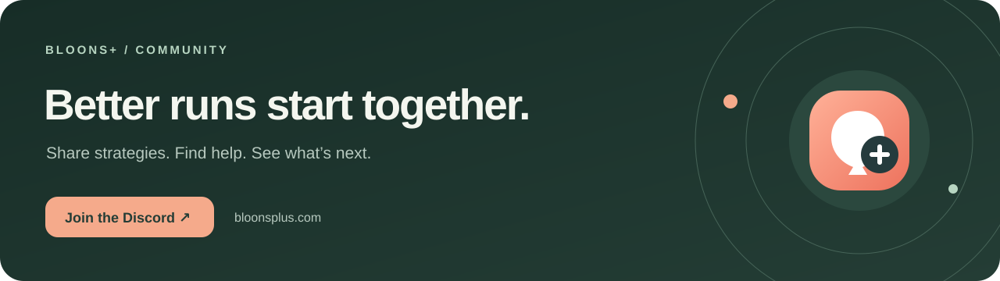

<p align="center">
  <a href="https://bloonsplus.com/"></a>
</p>

<p align="center"><strong>Your game. A clearer overview.</strong><br>A Windows companion for Bloons TD 6. Routes, progress and VM control in one place.</p>

<p align="center">
  <a href="https://bloonsplus.com/">Website</a> ·
  <a href="https://github.com/Klaasawastaken/BloonsPlus/releases">Download</a> ·
  <a href="https://bloonsplus.com/docs/">Docs</a> ·
  <a href="https://bloonsplus.com/wiki/">Wiki</a> ·
  <a href="https://discord.gg/qxUGXqrXsY">Discord</a> ·
  <a href="https://github.com/Klaasawastaken/BloonsPlus/issues">Report an issue</a>
</p>

## More play. Less busywork.

Bloons+ brings recorded strategies, tower progress and map runs into a desktop control centre. Run BTD6 inside a Windows VM and manage it from your main PC.

| Your next step | What Bloons+ brings together |
| --- | --- |
| **Pick a map** | Map, difficulty, variation and route requirements. |
| **Follow a run** | Replay actions, checkpoints, pause and stop controls. |
| **See your progress** | Supported local save reads and Steam achievement data. |
| **Manage your guest** | VM setup, connection status and app deployment. |
| **Improve a strategy** | Route tools, logs and failure evidence. |

**Active development:** available routes are not guaranteed victories on every game version. Boss execution and the complete tower auto-unlock loop remain unfinished. Read the [implementation status](CODE_REVIEW_2026-10-03.md) before planning an unattended session.

## Three steps to your next run

1. **Get the companion.** Download `BloonsPlusSetup.exe` from [Releases](https://github.com/Klaasawastaken/BloonsPlus/releases) and complete dependency setup.
2. **Connect your game.** Follow the app’s VM setup, sign in through Steam inside the guest and install your owned copy of BTD6.
3. **Start with one map.** Open BTD6, check the connection and try a Specific Map run. Watch placement, upgrades and the result before starting a larger sweep.

You need Windows, an internet connection and a Steam account that owns BTD6. VM setup requires supported virtualization and Windows features; system setup may request administrator access. Steam handles sign-in and Steam Guard.

### Your desktop, your space


The main PC runs the interface; the guest runs the game and replay engine. Gameplay uses simulated mouse and keyboard input. Save readers only read game files. Local automation can use your desktop input; VM automation uses the guest’s input.

GitHub changes do not automatically update an installed copy. Use the app’s VM update controls to deploy a new build.

## Build from source

Install Git, Node.js/npm and Python 3.12. In PowerShell:

```powershell
git clone https://github.com/Klaasawastaken/BloonsPlus.git
cd BloonsPlus
npm ci
py -3.12 -m venv .venv
.\.venv\Scripts\python.exe -m pip install -r requirements-installer.txt
Copy-Item autobtd6/userconfig.example.json autobtd6/userconfig.json
npm run app
```

Copy the example configuration only on a fresh checkout; preserve existing settings. `npm run app` opens the desktop app. `npm start` starts the development web server. Installer build instructions are in [GITHUB_SETUP.md](GITHUB_SETUP.md).

<details>
<summary><strong>Project layout & languages</strong></summary>

| Location | Purpose |
| --- | --- |
| `app.js`, `index.html`, `styles.css` | Desktop interface |
| `server.js`, `electron-main.js` | Local API and desktop entry point |
| `autobtd6/` | Python replay engine and recorded routes |
| `vm/` | Guest provisioning |
| `route-library/` | Imported strategies and provenance |
| `installer-bootstrap.cs`, `make-installer.py` | Windows installer and builder |
| `docs/` | Product website, tutorials and illustrations |

JavaScript runs the app; Python handles replay and image processing. HTML/CSS present the interface. C# builds the installer, while Windows integration uses PowerShell and an AutoHotkey input helper. [Full language breakdown](docs/languages.md).

</details>

## When something needs attention

| Symptom | First check |
| --- | --- |
| Missing `msvcp140.dll` or `msvcp140_1.dll` | Repair the Microsoft Visual C++ x64 runtime **where replay runs**, including the guest. |
| VM bridge reconnecting or SSH permission denied | Check guest availability and the setup’s SSH identity. |
| Stale activity or progress | Confirm the host is connected to the correct guest and both have the latest app version. |
| A stalled or lost route | Share map, mode, variation, round, version and surrounding logs in an issue. |

Keep player saves, Steam credentials, SSH keys and VM disks private. Review logs for personal information before sharing them.

## Join the community

<a href="https://discord.gg/qxUGXqrXsY"></a>

Created by **klaasa**. Contributions are welcome; no contributors are listed yet. Visit [GitHub](https://github.com/Klaasawastaken/BloonsPlus) or [Discord](https://discord.gg/qxUGXqrXsY) to follow development.

## Credits

Built around and informed by [AutoBTD6](https://github.com/ANRAR4/AutoBTD6), [BTD6bot](https://github.com/j-miet/BTD6bot) and [btd6_autoplay](https://github.com/Jazzmoon/btd6_autoplay). Imported material retains its licenses and attribution.

Bloons TD 6 and its game assets belong to Ninja Kiwi. Bloons+ is an independent project, unaffiliated with Ninja Kiwi.
