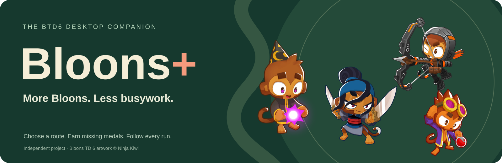

<p align="center">
  <a href="https://bloonsplus.com/"></a>
</p>

<p align="center"><strong>More Bloons. Less busywork.</strong><br>Choose your next run. Follow the game. Keep progressing.</p>

<p align="center">
<a href="https://bloonsplus.com/">Website</a> · <a href="https://bloonsplus.com/features/">Features</a> · <a href="https://bloonsplus.com/download/">Download</a> · <a href="https://bloonsplus.com/wiki/">Wiki</a> · <a href="https://discord.gg/qxUGXqrXsY">Discord</a>
</p>

## Your next run, together

Bloons+ is a Windows companion for Bloons TD 6. Select a map and variation, launch a recorded strategy, and follow your game from a desktop app. A VM can keep gameplay on the guest while your main desktop stays free.

| Feature | What you can do |
| :--- | :--- |
| **Map automation** | Choose a map, difficulty and variation; review the hero and tower paths needed. |
| **Live game view** | Watch the VM game inline while the app is visible. |
| **Run controls** | Pause, stop now, or stop after the current replay. |
| **Progress overview** | Browse supported map medals, achievements and account statistics. |
| **Diagnostics** | Follow actions, inspect failures and download redacted logs. |
| **Guest setup** | Check required components, connect a VM and deploy app updates. |

**Preview:** recordings can lose, particularly after game updates or on maps with changing mechanics. Boss events are coming soon. Experimental recovery is not a guarantee of victory.

## Three steps to your next run

1. **Install.** Download the Windows installer from [Releases](https://github.com/Klaasawastaken/BloonsPlus/releases). Dependencies download during setup.
2. **Connect.** Complete the VM setup and install your owned copy of BTD6 through Steam in the guest. Steam handles sign-in and Steam Guard.
3. **Play.** Open Automation, choose a map and mode, check requirements and start a replay. Verify placements and the saved result on your first run.

You need Windows, internet access and a Steam account that owns BTD6. VM setup requires supported virtualization and Windows features; some setup steps need administrator access or a restart.

[Installation methods →](https://bloonsplus.com/download/#installation-methods) · [Troubleshooting →](https://bloonsplus.com/wiki/diagnostics/)

## Build and contribute

```powershell
git clone https://github.com/Klaasawastaken/BloonsPlus.git
cd BloonsPlus
npm ci
py -3.12 -m venv .venv
.\.venv\Scripts\python.exe -m pip install -r requirements-installer.txt
Copy-Item autobtd6/userconfig.example.json autobtd6/userconfig.json
npm run app
```

Copy the example configuration only on a fresh checkout. Preserve existing settings. `npm start` runs the local development server.

| Location | Purpose |
| :--- | :--- |
| Root entry points | Desktop window, local API and interface |
| `lib/` | Backend modules: automation, progress, capture, setup and VM bridge |
| `autobtd6/` | Replay engine and recorded strategies |
| `docs/` | Website, wiki and developer reference |
| `tools/` | Build, import and maintenance scripts |
| `vm/` | Guest provisioning |
| `data/`, `assets/` | Shared catalogs and application artwork |
| `route-library/`, `licenses/` | Strategy provenance and third-party notices |
| `tests/` | Focused offline regression checks |

[Developer guide →](https://bloonsplus.com/wiki/development/) · [Route format →](https://bloonsplus.com/wiki/route-format/) · [Build reference →](docs/developer/README.md)

## Community and privacy

Built by **klaasa**. Join [Discord](https://discord.gg/qxUGXqrXsY) to share strategies and get help, or [open an issue](https://github.com/Klaasawastaken/BloonsPlus/issues) with your app version, map, variation and redacted logs.

Gameplay uses simulated mouse and keyboard. Game save readers do not modify saves. Never publish credentials, VM keys, player profiles or personal screenshots. Installed copies require an app update; a GitHub push alone does not update them.

Bloons TD 6 belongs to Ninja Kiwi. Bloons+ is independent and is not affiliated with Ninja Kiwi. Imported software, routes and artwork retain their notices in `licenses/` and source metadata.
