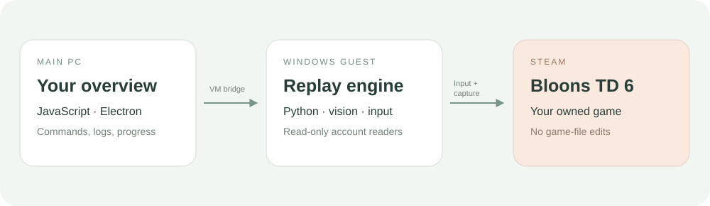

<p align="center"></p>

<p align="center"><strong>A Windows companion for Bloons TD 6.</strong><br>Recorded strategies. Account progress. One place to control your VM.</p>
<p align="center"><a href="https://klaasawastaken.github.io/BloonsPlus/">Illustrated guide</a> · <a href="GITHUB_SETUP.md">Source setup</a> · <a href="docs/languages.md">Language breakdown</a> · <a href="https://github.com/Klaasawastaken/BloonsPlus/issues">Report an issue</a></p>

## What is Bloons+?

Bloons+ combines an Electron desktop interface with a Python replay engine. You can manage map runs, inspect progress and control a game running inside a Windows VM from your main PC.

**This project is in active development.** A route being available does not guarantee a victory on the current game version. Boss execution and the complete automatic tower-unlock loop still need work. See the [current code review](CODE_REVIEW_2026-10-03.md) for the practical limits.

| Area | What it does |
| --- | --- |
| Automation | Specific map runs and sweeps using recorded actions, with pause, stop and checkpoints. |
| Progress | Reads supported account data from local saves and Steam achievement data. |
| VM control | Connects the main PC interface to the guest app, status and deployment tools. |
| Route tools | Browse, import, export and edit strategies. |
| Diagnostics | Replay logs, failure evidence and recovery heuristics for selected problems. |

Gameplay uses simulated mouse and keyboard input. Save readers are read-only. Running the game inside a VM separates its input from your main desktop; local automation can use your actual desktop input.

## Get started

### Installer

Check [Releases](https://github.com/Klaasawastaken/BloonsPlus/releases) for an installer. This source repository does not include the generated BloonsPlusSetup.exe; if no release asset is available, use the source instructions below.

1. Run the installer and complete dependency setup.
2. Open Bloons+ and follow the VM setup steps when using a guest.
3. Sign in to Steam **inside the VM** and install your owned copy of BTD6.
4. Open BTD6, reach its main menu and confirm the app shows a live connection.
5. Try one **Specific Map** run before starting a larger sweep.

You need Windows, internet access for downloads, and a Steam account that owns BTD6. VM setup also needs supported virtualization and the relevant Windows features; system setup may request administrator access. Steam sign-in and Steam Guard happen through Steam.

### Run from source

Install Node.js/npm, Git and Python 3.12 first. In PowerShell:

```powershell
git clone https://github.com/Klaasawastaken/BloonsPlus.git
cd BloonsPlus
npm ci
py -3.12 -m venv .venv
.\.venv\Scripts\python.exe -m pip install -r requirements-installer.txt
Copy-Item autobtd6/userconfig.example.json autobtd6/userconfig.json
npm run app
```

Copy the example configuration only on a fresh checkout; preserve an existing configuration. `npm run app` opens the desktop app. `npm start` runs the web server for development. See [GITHUB_SETUP.md](GITHUB_SETUP.md) for installer builds and dependencies.

## How it fits together



The main PC runs the interface. The guest runs the replay engine beside BTD6. The bridge transfers commands, status and app updates. Updating GitHub alone does not update an installed VM; deploy the updated app through the VM update controls.

## Languages: what each one does

| Language / format | Responsibility | Recommendation |
| --- | --- | --- |
| **JavaScript** | Electron, UI behavior, HTTP server, route management, progress readers and VM bridge. | Keep as the main application language. |
| **Python** | Replay engine, image/OCR processing, input integration, route utilities, VM provisioning and installer builder. | Keep as the automation language. |
| **HTML + CSS** | Interface structure, glass styling and documentation. | Keep; these are presentation layers. |
| **C#** | Windows installer/bootstrapper UI and dependency installation. | Optional future replacement; needs a reliable bootstrap alternative. |
| **PowerShell** | Embedded Windows commands: features, elevation, processes and VM/SSH setup. | Consolidate into one Windows integration layer. |
| **AutoHotkey** | Live replay keyboard sender; also imported reference scripts. | Replace the small live sender with Python input after validating timing and focus. |
| **Batch / CMD** | Developer VM setup launcher. | Can eventually move behind app setup. |
| **Rust** | Vendored btd6_autoplay reference engine. | Not part of the active app execution path. |
| **JSON, YAML, TOML, .btd6** | Configuration, catalogs and recorded strategy data. | Data formats, not separate application runtimes. |
| **Markdown + SVG** | Documentation and vector illustrations. | Documentation/assets, not runtime languages. |

**Recommended target: JavaScript + Python, with a small Windows adapter.** Removing Rust reference code or imported scripts reduces repository clutter. It does not make the active replay faster. Consolidating AutoHotkey and installer code needs behavioral validation first. Read the [full breakdown and migration order](docs/languages.md).

## Find your way around

```text
app.js / index.html / styles.css   Desktop interface
server.js                         Local API
electron-main.js                  Desktop entry point
autobtd6/                         Replay engine and recorded routes
vm/                               Guest setup and bridge support
route-library/                    Imported strategies and provenance
installer-bootstrap.cs            Windows installer source
make-installer.py                 Build the installer
docs/                             Illustrated guide and language report
```

## Troubleshooting

| Symptom | First check |
| --- | --- |
| TensorFlow reports msvcp140.dll or msvcp140_1.dll missing | Install/repair the Microsoft Visual C++ x64 runtime on the PC **where the replay runs**, including the guest if applicable. |
| VM bridge reconnects or SSH says permission denied | Check the guest is running and its SSH identity matches setup. A working game window alone does not confirm a working bridge. |
| App shows stale status or progress | Confirm whether you are viewing the host or guest, and whether the guest has the latest deployment. |
| Route stalls or loses | Include map, difficulty, variation, round, app version and the surrounding replay log in an issue. |

Keep player saves, Steam credentials, SSH keys, runtime logs and VM disks out of Git. The repository ignore rules exclude these local files. Use the app's logs to share a specific failure, after checking for personal information.

## Documentation site

The custom guide lives in [docs/index.html](docs/index.html). It uses static HTML, CSS, JavaScript and original SVG illustrations, with no package dependencies. The GitHub Pages link above becomes available after enabling **Settings → Pages → Deploy from a branch → main → /docs**.

## Credits

Built around and informed by [AutoBTD6](https://github.com/ANRAR4/AutoBTD6), [BTD6bot](https://github.com/j-miet/BTD6bot) and [btd6_autoplay](https://github.com/Jazzmoon/btd6_autoplay). Imported material retains its existing license and attribution; consult the relevant source directories before redistributing it.

Bloons TD 6 and its game assets belong to Ninja Kiwi. Bloons+ is an independent companion project. Documentation illustrations are original interface diagrams, not game screenshots.
